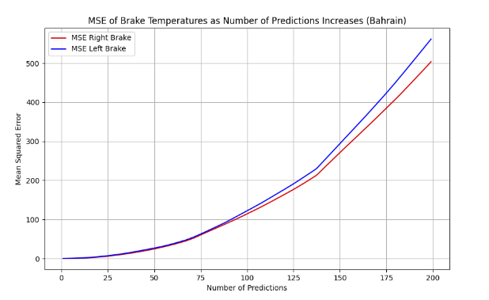

## Overview + Idea Behind Model

This repo contains Python code to predict left and right brake temps in a F1 car, using data from six races. I decided to use an ML gradient boosting machine model because in the context of F1 where you constantly have new race data, it can easily be added to the model periodically, improving accuracy over time, plus gradient boosting machines are great for predicting complex, non-linear relationships between features and target variables. I decided to go with XGBoost, mainly because it includes L1 and L2 regularization (I used L2) , which helps prevent the model from overfitting, which i thought might be an issue because of the complexity and noise in the data. When refining the hyperparameters, I used GridSearchCV with TimeSeriesSplit to keep the chronological order.

Before creating my model, I did some correlation and regression testing to confirm some physics/common-sense based theories I had about how the channels would interact (eg. I made an acceleration (deltaSpeed) feature because when the car accelerates theres more air going into the ducts so the brakes cool down faster). I realised that only taking the negative parts of my acceleration to model braking periods was not enough, because the car still decelerates when you lift the throttle without even touching the brake, so I ran some tests to see at what threshold a negative delta speed corresponds to actual braking and found -2.

From there, I realised through splitting the data set and running correlation calculations that interaction between the delta brake temps and the other variables is completely different in braking vs non-braking periods, so I decided to do two seperate models for each of the left and right brakes. (I modelled delta brake temp instead of brake temp since that was what showed strongest correlations with other variables), and then in the model_test_bahrain.py file, I applied the relevant model (which I create using xgboost in the model_training.py file) to each data point based on whether the delta speed from the last point is less than or more than -2. Since my model calculates the delta, I simply add it on to the last known value to get the actual brake temp. This testing can be seen concretely in model_test_bahrain.py and can be applied on new data in model_test_new.py.

The main problem is that the braking parts (when delta speed is below 2) of the prediction are more accurate than the rest as there's obviously a strong correlation between delta brake temp and delta speed when the car is braking, so if I had more time I would do some more feature engineering and experiment with model complexity like depth of trees to try and understand the how different factors interact to impact the temperature of brakes when they’re not braking. 

### Improvements

Given more time, I would:

1. **Clean!!** I realised towards the end that there were some data points that didn't make sense, like decreases of 1000 degrees in one time unit, so I should have cleaned the data at the beginning for more accurate results. I did some using z-scores in model_training.py but I could definitely clean more thoroughly.

2. **Create a lap identifier** by looking at the track and then matching up its turns to left and right braking data, as the left tyre heats more when making a right turn and vice versa so I could probably identify a lap by looking at a given pattern of left and right turns repeating. I tried using peak detection, clustering and a Fourier transform to identify repeating patterns but it was inconclusive.

3. **Do more feature engineering** like for the duration of braking periods, rolling averages of temperatures and speeds, and binary indicators for specific race conditions (e.g., pit stops, rain). That could improve prediction accuracy in the non-braking periods. I should also probably have incorporated an actual time series model to help with this.

4. **More detailed error analysis and testing**, identifying patterns in prediction errors and correlating them with specific race conditions or driving behaviors could help in refining my models further.

### Initial Data Requirement

The model uses both direct measurements and engineered features that capture temporal changes. Enough data is needed to allow the model to learn the significance of these features across different racing conditions. Basically, having data from several races, covering a variety of conditions (e.g., different tracks, weather conditions), would provide a solid foundation for training it.

### Forecasting Capability

With more time, I would do a deeper dive on performance metrics (e.g., RMSE, MAE) as the forecast horizon extends to know when results are no longer trustworthy. GBM models like XGBoost aren't really designed for multi-step time series forecasting because they predict the next step based on past and current data so the further into the future you try to forecast, the more uncertainty accumulates. To mitigate this, I would create features based on rolling windows (e.g., the average of the last n observations) to capture more of the temporal context in the features.

- **Unseen Tracks**: Because my model is trained mostly on the underlying principles of brake heating and cooling, rather than memorizing track-specific patterns, it should respond relatively well initially to a completely unseen track. Also, since the training data includes a diverse set of tracks and conditions, its even more likely to generalize well to new tracks. Obviously error will accumulate as time goes on though and if the new tracks are significantly different from those in the training set (e.g., much longer straights, different surface materials), the model may struggle without fine-tuning or retraining on data that includes similar conditions to the new track.

### (Results (edited 31st March)):
I forgot to put in the actual results for this from when I tested my model, taking Bahrain as my 'new' data on which to predict. I added the file in which I did this (model_test_bahrain.py) and how the MSE increases with every time unit. 

**With only one prediction, so predicting the next data point from the beginning, my values were good (MSE for Right Brake Temperature: 0.0037966531666941646, MSE for Left Brake Temperature: 0.054960822420475904)** and given that the temperature ranges in the thousands, this is quite accurate, 

but I graphed the MSE as the number of predictions increase, and it does accumulate error, as seen below. I think this is worsened by the inacuraccy of the model in the non-braking periods accumulating, and i've mentioned how I would try to fix that given more time.
The difference between the left and right I think is because I didn't clean the data, and outliers are affecting the model.

When I tested it on predicting the full length of the Bahrain dataset from the beginning, (45904 points), I got MSE for Right Brake Temperature: 934536.1713261772, MSE for Left Brake Temperature: 947313.5716380291 which isn't great given that those correspond to absolute values of around 966 and 973 respectively and the standard deviation for brake temp is around 200. The further we go in time the more the error accumulates, but it's fairly accurate (below std dev) for around 5000 predictions, varying depending on the race.

### Most important factors for the model: (used built-in xgboost importance)

(my model was to predict delta brake temp so these are the factors that most affected delta brake temp)

* Most Important Feature for Model R Greater Than -2: deltaSpeed with an importance of 0.87848794
* Most Important Feature for Model L Greater Than -2: deltaSpeed with an importance of 0.88700086
* Most Important Feature for Model R Less Than or Equal to -2: deltaSpeed with an importance of 0.9942036
* Most Important Feature for Model L Less Than or Equal to -2: deltaSpeed with an importance of 0.9936026

